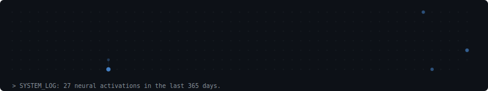

  

`[ SYSTEM STATUS ]` 🟢 **Open to work** | 🏢 Final Year Student | 🏗️ Currently building: **[Project Name]**

### 🚀 Featured Work

**[Real-Time Multimodal Emotion Detection](https://github.com/sanjaysenthil17/Real-Time-Multimodal-Emotion-Detection-with-YOLO-ViT-and-Spark-Streaming)** 
Problem: Needed a scalable pipeline for real-time edge-to-cloud emotion analytics.
Built: (Python, YOLO, ViT, Spark Structured Streaming, HDFS, Scala). 
Result: Built an end-to-end pipeline syncing webcam frames to HDFS, processing Bronze/Silver/Gold layers for windowed KPIs. 
[Repo](https://github.com/sanjaysenthil17/Real-Time-Multimodal-Emotion-Detection-with-YOLO-ViT-and-Spark-Streaming)

**[Music Emotion Recognition](https://github.com/sanjaysenthil17/Music-Emotion-Recognition-using-CNN-and-HuBert)** 
Problem: Extracting nuanced emotional signals from raw audio waveforms.
Built: (Python, CNNs, HuBert). 
Result: Implemented state-of-the-art audio models to accurately classify music emotion. 
[Repo](https://github.com/sanjaysenthil17/Music-Emotion-Recognition-using-CNN-and-HuBert)

**[Monte Carlo Simulation in Supply Chain](https://github.com/sanjaysenthil17/Monte-Carlo-Simulation-in-supply-chain-management)** 
Problem: Unpredictable variables leading to supply chain inefficiencies and stockouts.
Built: (Python, Monte Carlo Methods). 
Result: Simulated probabilistic outcomes to optimize supply chain decision-making under uncertainty. 
[Repo](https://github.com/sanjaysenthil17/Monte-Carlo-Simulation-in-supply-chain-management)

### 💻 Core Stack

- **ML & Data:** Python, PyTorch, Scikit-Learn, Pandas, SQL
- **Backend & Infra:** FastAPI, Node.js, Docker, AWS (EC2, S3)
- **Tools:** Git, GitHub Actions, Linux/Bash, Terraform

### 📡 Live Feed
<!-- LATEST_COMMIT_START -->
> ⚡ Latest Commit: sanjaysenthil17/portfolio - "chore: update build configs" (2h ago)
<!-- LATEST_COMMIT_END -->

### 🧠 Neural Activity (Last 365 Days)

  

### 🧠 How I Approach Engineering
I believe in starting with the simplest baseline model before reaching for complex architectures. My focus is on writing clean, modular code that bridges the gap between data science and production engineering. To me, a model isn't finished until it's deployed and monitored in the real world.

📂 <b>Background & Extras</b>

 

- **Education:** [Degree] in [Major], [University] (Expected 202X)
- **Research:** [Paper/Topic Name] - [Short description of findings]
- **Certifications:** [e.g., AWS Certified Machine Learning Specialty]
- **Personal:** [Authentic detail, e.g., I restore vintage mechanical keyboards in my free time.]

[Portfolio](https://sanjaysenthil17.github.io/) • [LinkedIn](https://linkedin.com/in/sanjay-senthil-367909308) • [Email](mailto:ssanjaychakravar@gmail.com)
